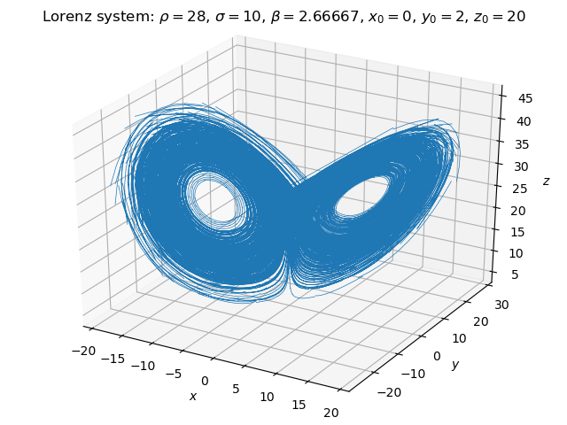

# pydgq


[](http://makeapullrequest.com/)

Solve ordinary differential equation (ODE) systems using the time-discontinuous Galerkin method, with Cython acceleration.

We use [semantic versioning](https://semver.org/).

For my stance on AI contributions, see the [collaboration guidelines](https://github.com/Technologicat/substrate-independent/blob/main/collaboration.md).




## Introduction

This is a Cython-accelerated library that integrates initial value problems (IVPs) of first-order ordinary differential equation (ODE) systems of the form `u'(t) = f(u, t)`.

The main feature of the library is dG(q), i.e. the time-discontinuous Galerkin method using a Lobatto basis (a.k.a. hierarchical polynomial basis). Some classical explicit and implicit integrators (`RK4`, `RK3`, `RK2`, `FE`, `SE`, `IMR`, `BE`) are also provided, mainly for convenience.

Time-discontinuous Galerkin is a very accurate implicit method that often allows using a rather large timestep. Due to its Galerkin nature, it also models the behavior of the solution inside the timestep (although best accuracy is obtained at the endpoint of the timestep).

Arbitrary polynomial degrees `q` are supported, but often best results are obtained for `q = 1` (dG(1)) or `q = 2` (dG(2)). (The example image above has been computed using dG(2). Note the discontinuities at timestep boundaries.)

The focus of this library is on arbitrary nonlinear problems. All implicit methods are implemented using fixed-point (Banach/Picard) iteration, relying on the Picard-Lindelöf theorem (which itself relies on the Banach fixed point theorem).

For supplying the user code implementing the right-hand side (RHS) `f(u, t)` for a given problem, both Python and Cython interfaces are provided.

For material on the algorithms used, see the [user manual](doc/pydgq_user_manual.pdf).


## Installation

### From PyPI

```bash
pip install pydgq
```

### From source

```bash
git clone https://github.com/Technologicat/pydgq.git
cd pydgq
pip install .
```

### Performance builds

The default build uses meson's release optimization (`-O2`). For numerically intensive workloads, you can enable architecture-specific optimizations:

```bash
CFLAGS="-march=native -O2 -msse -msse2 -mfma -mfpmath=sse" pip install --no-build-isolation .
```

Note: wheels on PyPI are built without `-march=native` for portability. Build from source if you want maximum performance on your specific hardware.

### Development

```bash
pdm install                              # creates venv, installs dev deps
pip install --no-build-isolation -e .    # editable install (needs venv activated)
pdm run pytest tests/ -v                 # run tests
```

The `--no-build-isolation` flag is required for editable installs with meson-python — the on-import rebuild mechanism needs build dependencies to remain available in the environment.

**PATH note:** The meson-python editable loader needs `meson` and `ninja` on `PATH`. If you get rebuild errors, ensure the venv's `bin/` is on the path:

```bash
export PATH="$(pwd)/.venv/bin:$PATH"
```


## Usage summary

The user is expected to provide a custom kernel, which computes the RHS `f(u, t)` for the specific problem to be solved.

The problem is solved by instantiating this custom kernel, and passing the instance to the `ivp()` function of the [`pydgq.solver.odesolve`](pydgq/solver/odesolve.pyx) module (along with solver options).

A Cython example kernel is provided in [`pydgq.examples.example_kernel`](pydgq/examples/example_kernel.pyx). A standalone visualization script (Lorenz attractor) is in [`examples/`](examples/).


## Software architecture

The design of pydgq is based on two main class hierarchies, consisting of Cython extension types (cdef classes):

 - [**IntegratorBase**](pydgq/solver/integrator_interface.pyx): interface class for integrator algorithms
   - [**ExplicitIntegrator**](pydgq/solver/integrator_interface.pyx): base class for explicit methods, which are implemented in [`pydgq.solver.explicit`](pydgq/solver/explicit.pyx):
     - _RK4_: fourth-order Runge-Kutta
     - _RK3_: Kutta's third-order method
     - _RK2_: parametric second-order Runge-Kutta
     - _FE_: forward Euler (explicit Euler)
     - _SE_: symplectic Euler, for 2nd-order systems reduced to a twice larger 1st-order system
   - [**ImplicitIntegrator**](pydgq/solver/integrator_interface.pyx): base class for implicit methods, which are implemented in [`pydgq.solver.implicit`](pydgq/solver/implicit.pyx):
     - _IMR_: implicit midpoint rule
     - _BE_: backward Euler (implicit Euler)
     - [**GalerkinIntegrator**](pydgq/solver/galerkin.pyx): base class for Galerkin methods using a Lobatto basis, which are implemented in [`pydgq.solver.galerkin`](pydgq/solver/galerkin.pyx):
       - _DG_: discontinuous Galerkin
       - _CG_: continuous Galerkin
 - [**KernelBase**](pydgq/solver/kernel_interface.pyx): interface class for RHS kernels
   - [**CythonKernel**](pydgq/solver/kernel_interface.pyx): base class for kernels implemented in Cython, see [`pydgq.solver.builtin_kernels`](pydgq/solver/builtin_kernels.pyx) for examples:
     - _Linear1stOrderKernel_: `w' = M w`
     - _Linear1stOrderKernelWithMassMatrix_: `A w' = M w`
     - _Linear2ndOrderKernel_: `u'' = M0 u + M1 u'`
       - solved as a twice larger 1st-order system, by defining `v := u'`, thus obtaining `u' = v` and `v' = M0 u + M1 v`
       - the DOF vector is defined as `w := (u1, v1, u2, v2, ..., um, vm)`, where `m` is the number of DOFs of the original 2nd-order system.
     - _Linear2ndOrderKernelWithMassMatrix_: `M2 u'' = M0 u + M1 u'`
       - solved as `u' = v` and `M2 v' = M0 u + M1 v` similarly as above
     - CythonKernel acts as a base class for your own Cython-based kernels
   - [**PythonKernel**](pydgq/solver/kernel_interface.pyx): base class for kernels implemented in Python
     - PythonKernel acts as a base class for your own Python-based kernels

The `ivp()` function of [`pydgq.solver.odesolve`](pydgq/solver/odesolve.pyx) understands the `IntegratorBase` and `KernelBase` interfaces, and acts as the driver routine.

Aliases to primitive data types (to allow precision switching at compile time) are defined in `pydgq.solver.types`: [Python (import)](pydgq/solver/types.pyx), [Cython (cimport)](pydgq/solver/types.pxd). The Python-accessible names point to the appropriate NumPy symbols. `RTYPE` is real, `ZTYPE` is complex, and `DTYPE` is an alias representing the problem data type. The corresponding Cython-accessible datatypes have the `_t` suffix (`RTYPE_t`, `ZTYPE_t`, `DTYPE_t`).

Currently, `DTYPE` is real, but it is kept conceptually separate from `RTYPE` so that complex-valued problems can be later supported, if necessary (this requires some changes in the code, especially any calls to `dgesv`).


## Linear and nonlinear problems

The built-in kernels concentrate on linear problems, because for this specific class of problems, it is possible to provide generic pre-built kernels. The provided set of four kernels attempts to cover the most common use cases, especially the case of small-amplitude vibration problems in mechanics, which are of the second order in time, and typically have all three matrices `M0`, `M1` and `M2`.

The main focus of the library, however, is on solving arbitrary nonlinear problems, and thus no algorithms specific to linear problems have been used. This makes the solver severely suboptimal for linear problems, but significantly increases flexibility.

Be aware that due to this choice of approach, the usual stability results for integrators for linear problems do not apply. For example, BE is no longer stable at any timestep size, because for large enough `dt`, contractivity in the Banach/Picard iteration is lost. (The standard results are based on classical von Neumann stability analysis; without modifications, these arguments are not applicable to the algorithm based on Banach/Picard iteration.)


## Lobatto basis functions / precalculation

The numerical evaluation of the Lobatto basis functions is numerically highly sensitive to catastrophic cancellation (see the [user manual](doc/pydgq_user_manual.pdf)); IEEE-754 double precision is insufficient to compute the intermediate results. To work around this issue, the basis functions are pre-evaluated once, by the module [`pydgq.utils.precalc`](pydgq/utils/precalc.py), using higher precision in software (via [mpmath](https://mpmath.org/)).

The precalculation can be run again by running the module as the main program, e.g. `python -m pydgq.utils.precalc`. The module has some command-line options; use the standard `--help` option to see them.

The precalc module stores the values of the basis functions (at quadrature points and at visualization points, both on the reference element `[-1,1]`) into `pydgq_data.npz`, a compressed NumPy archive.

A data file with default precalc settings (`q = 10`, `nx = 101`) is included in the package. It is architecture-independent.

When running the solver, to use Galerkin methods, [`pydgq.solver.galerkin.init()`](pydgq/solver/galerkin.pyx) must be called before calling [`pydgq.solver.odesolve.ivp()`](pydgq/solver/odesolve.pyx).


## Data file location

During `pydgq.solver.galerkin.init()`, the solver attempts to load `pydgq_data.npz` from these locations, in this order:

 1. `./pydgq_data.npz` (local override),
 2. `~/.config/pydgq/pydgq_data.npz` (user override),
 3. Installed package data, via `importlib.resources`.

If all three steps fail, an error is raised.


## Dependencies

**Runtime:** [NumPy](http://www.numpy.org), [PyLU](https://github.com/Technologicat/pylu)

**Build:** [Cython](http://www.cython.org) (≥ 3.0), [meson-python](https://mesonbuild.com/meson-python/)

**Precalculation only:** [mpmath](https://mpmath.org/) (extended-precision arithmetic for Lobatto basis evaluation)

**Examples:** [Matplotlib](http://www.matplotlib.org) (for the Lorenz visualization script in [`examples/`](examples/))


## License

[BSD](LICENSE.md). Copyright 2016-2026 Juha Jeronen and University of Jyväskylä / JAMK University of Applied Sciences.


#### Acknowledgement

This work was financially supported by the Jenny and Antti Wihuri Foundation.


